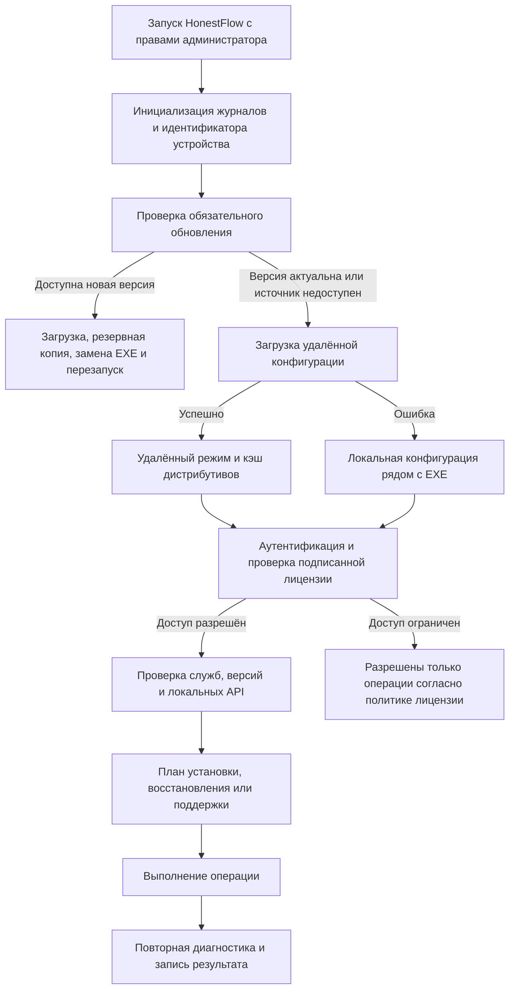

# HonestFlow

HonestFlow — административное Windows-приложение для подготовки, проверки и сопровождения рабочих мест, использующих компоненты «Честного Знака». Приложение объединяет диагностику состояния точки, установку и восстановление компонентов, удалённую поддержку, обновление и контроль доступа в одном управляемом сценарии.

> [!IMPORTANT]
> HonestFlow запускается с правами администратора и предназначен для контролируемого инженерного использования на Windows x64.

| Контур | Что делает HonestFlow |
|---|---|
| Состояние точки | Проверка ЛМ ЧЗ, контроллера, ЕСМ, ККТ, служб Windows и RuDesktop |
| Обслуживание | Плановая установка, выборочная переустановка, инициализация и восстановление ЛМ ЧЗ |
| Поддержка | Сбор ограниченного по времени диагностического архива, отправка в поддержку, настройка RuDesktop |
| Эксплуатация | Локальная и удалённая конфигурация, кэш дистрибутивов, проверка обновлений при запуске |
| Контроль доступа | Подписанный ECDSA-манифест, привязка к устройству, функциональные разрешения и автономный период |
| Наблюдаемость | Централизованный файловый журнал с маскированием типовых секретов и ротацией |

## Содержание

- [Что такое HonestFlow](#что-такое-honestflow)
- [Какие проблемы решает](#какие-проблемы-решает)
- [Основные возможности](#основные-возможности)
- [Как это работает](#как-это-работает)
- [Архитектура проекта](#архитектура-проекта)
- [Установка](#установка)
- [Конфигурация](#конфигурация)
- [Диагностика](#диагностика)
- [Лицензирование](#лицензирование)
- [Безопасность](#безопасность)
- [Сборка](#сборка)
- [Процесс релиза](#процесс-релиза)
- [Roadmap](#roadmap)
- [Вклад в проект](#вклад-в-проект)
- [Автор](#автор)

---

## Что такое HonestFlow

HonestFlow — WinForms-инструмент инженера сопровождения. Он определяет выбранную клиентскую точку, сопоставляет требуемые версии с фактическим состоянием машины и выполняет только необходимые операции.

В отличие от обычного установщика, HonestFlow работает со всем жизненным циклом рабочего места:

1. получает конфигурацию и проверяет право устройства на работу;
2. опрашивает службы Windows и локальные API компонентов;
3. строит план установки или восстановления по результатам проверки;
4. загружает либо использует локальные дистрибутивы;
5. запускает установщики, инициализацию и сервисные операции;
6. повторно показывает состояние точки и сохраняет технический журнал.

HonestFlow не заменяет штатные установщики ЛМ ЧЗ, ЕСМ, контроллера или драйвера АТОЛ. Он координирует их запуск и добавляет проверяемый эксплуатационный контекст вокруг установки.

### Термины

| Сокращение | Значение в проекте |
|---|---|
| ЛМ ЧЗ | Локальный модуль «Честного Знака» (`Regime`) |
| ЕСМ | Компонент с оркестратором и экземплярами `esm-cm-*`, состояние которых доступно через локальный API |
| ККТ | Контрольно-кассовая техника и связанные службы драйвера АТОЛ |
| Точка | Рабочее место конкретного клиента с назначенными параметрами, версиями и лицензией |

## Какие проблемы решает

| Инженерная проблема | Подход HonestFlow |
|---|---|
| Состояние точки распределено между службами Windows, портом ЛМ ЧЗ и API ЕСМ | Формируется единый снимок состояния компонентов с доступными действиями восстановления |
| Полная повторная установка создаёт лишний риск | План строится по фактическому состоянию; принудительная переустановка остаётся отдельной операцией инженера |
| Версии и дистрибутивы расходятся между точками | Общие версии задаются централизованно, клиентские исключения — в конфигурации точки, загруженные файлы кэшируются |
| Поддержке не хватает воспроизводимого набора данных | В один архив собираются известные продуктовые журналы, состояние точки и ограниченный системный снимок |
| Административные функции нельзя предоставлять любому экземпляру приложения | Доступ зависит от подписанной лицензии, клиента, устройства, версии приложения и разрешённой группы операций |

## Основные возможности

### Диагностика

- проверка служб `regime`, `yenisei`, `lm-controller`, `esm-orchestrator`, `esm-cm-*`, служб ККТ и RuDesktop;
- проверка готовности ЛМ ЧЗ через локальный интерфейс на порту `5995`;
- получение состояния контроллера, регистрации ЕСМ и подключения ККТ через локальный REST API;
- определение ID AnyDesk и RuDesktop, когда соответствующее ПО доступно;
- формирование системного снимка и диагностического ZIP-архива.

### Установка

- построение плана для ЛМ ЧЗ, драйвера АТОЛ, ЕСМ и контроллера;
- сравнение ожидаемых и установленных версий;
- локальный режим с папкой `Distr` и удалённый режим с загрузкой из публичного ресурса Yandex Disk;
- повторное использование кэша и обнаружение неполных загрузок по размеру;
- поддержка клиентских переопределений версий и параметра установки АТОЛ для конфигураций с тегом `With1C`;
- обнаружение и подготовка .NET 10 Desktop Runtime для обслуживаемого программного окружения.

### Восстановление

- инициализация ЛМ ЧЗ токеном и ИНН выбранной точки;
- выборочная переустановка компонентов;
- восстановление служб ЛМ ЧЗ;
- восстановление базы ЛМ ЧЗ из локального или удалённого архива;
- запуск и перезапуск известных служб Windows из интерфейса состояния.

### Удалённая поддержка

- проверка установки, службы и идентификатора RuDesktop;
- установка x86- или x64-пакета с проверкой размера, SHA-256 и подписи издателя;
- настройка постоянного пароля RuDesktop и сохранение локального состояния;
- отправка запроса помощи и диагностического архива через настроенный SMTP-канал.

### Обновление

- поиск каталога с наибольшей версией в опубликованном ресурсе Yandex Disk;
- загрузка `HonestFlow.exe` и проверка версии файла;
- замена исполняемого файла после завершения процесса;
- резервное копирование предыдущего EXE, восстановление при ошибке и журнал применения обновления.

### Лицензирование

- проверка отделённой ECDSA P-256/SHA-256 подписи над точными байтами манифеста;
- встроенный реестр доверенных открытых ключей; закрытый ключ в приложение не входит;
- привязка разрешений к клиенту и локальному идентификатору устройства;
- отдельные разрешения на просмотр/ремонт и установку/обслуживание;
- проверка минимальной версии HonestFlow, срока манифеста и автономного периода;
- атомарный локальный кэш только ранее проверенных снимков лицензии.

### Логирование

- отдельный журнал каждого запуска в `%ProgramData%\HonestFlow\logs`;
- уровни `DEBUG`, `INFO`, `WARNING` и `ERROR`, идентификатор сеанса и сведения об окружении;
- маскирование распространённых полей паролей, токенов, API-ключей и ИНН в текстовых сообщениях;
- удаление журналов старше 30 дней;
- отдельный журнал применения обновления и MSI-установки RuDesktop.

## Как это работает



Сетевые сбои удалённой конфигурации переводят запуск в локальный режим. Для лицензии автономная работа возможна только с ранее проверенным кэшем и в пределах периода, заданного для клиента в манифесте.

## Архитектура проекта

Решение разделено на пользовательский интерфейс, прикладные сценарии, инфраструктурные адаптеры и модели данных. `Program.cs` связывает реализации при запуске; отдельного контейнера внедрения зависимостей нет.

| Параметр | Значение |
|---|---|
| Приложение | C# / WinForms / `net10.0-windows` / `win-x64` |
| Публикация | Один EXE, без trimming, с внешним .NET Desktop Runtime |
| Сериализация | Newtonsoft.Json 13.0.3 |
| Защита локального состояния | Windows DPAPI (`LocalMachine`) |
| Тестирование | xUnit 2.9.3, Windows CI |

| Путь | Ответственность |
|---|---|
| `Program.cs` | Точка сборки приложения: запуск UI, логирование, обновление, идентификатор устройства, конфигурация и лицензирование |
| `Forms/` | WinForms-интерфейс: старт, вход продавца, главное окно, сервисное меню и прогресс проверки лицензии |
| `Application/Auth/` | Аутентификация продавца и интеграция проверки лицензии в процесс входа |
| `Application/Bootstrap/` | Выбор удалённого или локального режима и сборка зависимостей времени выполнения |
| `Application/Core/`, `Application/DeviceIdentity/` | Общие прикладные контракты: прогресс, журнал и стабильный идентификатор устройства |
| `Application/Diagnostics/` | Отбор журналов, системный снимок, архивирование и отправка диагностики |
| `Application/Feedback/` | Отправка оценки приложения через настроенный почтовый канал |
| `Application/Installation/` | Проверка версий, построение и выполнение плана установки |
| `Application/Licensing/` | Чтение, кэширование, наблюдение и применение лицензионной политики |
| `Application/Lm/` | Статус, валидация, установка, инициализация и восстановление ЛМ ЧЗ |
| `Application/PointIdentity/` | Определение и сохранение адреса рабочей точки |
| `Application/PointStatus/` | Агрегация статусов служб, контроллера, ЕСМ, ККТ и RuDesktop |
| `Application/Prerequisites/` | Обнаружение, загрузка и установка .NET 10 Desktop Runtime |
| `Application/RemoteAccess/` | Состояние, установка и настройка RuDesktop, запрос удалённой помощи |
| `Application/Security/` | Инженерный доступ: PBKDF2-SHA256, сессионная разблокировка и защита от перебора |
| `Application/Ui/` | Общие UI-сервисы: иконка окна и запуск внешних приложений |
| `Infrastructure/Api/` | Клиенты локальных API ЛМ ЧЗ и ЕСМ |
| `Infrastructure/Configuration/` | Карта путей, локальная/удалённая конфигурация и учёт кэшей |
| `Infrastructure/DeviceIdentity/` | Файловое хранение идентификатора устройства с защитой DPAPI |
| `Infrastructure/Downloads/` | Работа с публичным API Yandex Disk и загрузка файлов |
| `Infrastructure/Installers/` | Адаптеры установщиков ЛМ ЧЗ, АТОЛ, ЕСМ и контроллера |
| `Infrastructure/Licensing/` | Получение и проверка подписанных манифестов, DPAPI-метаданные кэша и регистрационные запросы |
| `Infrastructure/Logging/` | Централизованный файловый журнал, маскирование и ротация |
| `Infrastructure/Process/`, `Infrastructure/WindowsServices/` | Запуск внешних процессов, обнаружение и управление службами Windows |
| `Infrastructure/Updates/` | Обнаружение и применение самообновления |
| `Models/` | Конфигурационные модели, DTO API и лицензионный контракт |
| `Helpers/` | Поиск подходящего установщика АТОЛ по архитектуре точки |
| `HonestFlow.LicenseSigning/` | Библиотека формирования ECDSA-подписи манифеста; не входит в код запускаемого приложения |
| `HonestFlow.Tests/` | xUnit-тесты лицензирования, кэша, идентификатора устройства, статусов ЕСМ, RuDesktop и системных требований |
| `scripts/` | Воспроизводимый сценарий публикации и формирование SHA-256 манифеста сборки |
| `.github/` | CI, шаблон Pull Request и шаблон отчёта об ошибке |
| `Resourses/` | Иконка приложения; имя каталога сохранено в соответствии с текущим проектом |

`Properties/PublishProfiles` содержит профиль публикации Visual Studio. Каталоги `bin/`, `obj/` и `artifacts/` генерируются сборкой и публикацией; они не являются частью архитектуры исходного кода.

## Установка

### Для пользователя

Требования:

- Windows x64;
- .NET 10 Desktop Runtime для запуска HonestFlow;
- права локального администратора — они запрашиваются манифестом приложения;
- доступ к настроенному публичному ресурсу Yandex Disk для удалённой конфигурации, дистрибутивов, лицензии и обновлений.

Порядок установки:

1. Получите `HonestFlow-Web-Setup-<версия>.exe` у ответственного за развёртывание.
2. Запустите установщик; Windows запросит повышение прав.
3. Если Microsoft .NET 10 Desktop Runtime x64 отсутствует, установщик скачает с сервера Microsoft проверенную сборку и установит её.
4. После установки запустите HonestFlow через меню «Пуск» или созданный ярлык.

> [!NOTE]
> Web Setup содержит компактный HonestFlow, но не содержит .NET Runtime. Для установки без интернета позднее будет подготовлен отдельный Offline Setup. После запуска HonestFlow продолжает получать удалённую конфигурацию и дистрибутивы из настроенного источника Yandex Disk.

### Для разработчика

Необходимы Windows, .NET SDK 10, Git и Inno Setup 6 или 7. Visual Studio может использовать файл решения `HonestFlow.slnx`, но для сборки достаточно .NET CLI.

```powershell
git clone <repository-url>
cd HonestFlow
dotnet restore HonestFlow.slnx
dotnet build HonestFlow.csproj -c Debug --no-restore
dotnet test HonestFlow.Tests\HonestFlow.Tests.csproj -c Debug --no-restore
```

Рабочая конфигурация и закрытые ключи не требуются для компиляции и модульных тестов.

Web Setup собирается одной командой:

```powershell
.\scripts\build-web-installer.ps1
```

Скрипт запускает тесты, публикует framework-dependent single-file `HonestFlow.exe`, компилирует Inno Setup и сохраняет результат в `artifacts\installer\web`. URL и SHA-256 закреплённой версии .NET Desktop Runtime можно переопределить параметрами сборки при плановом обновлении runtime.


## Конфигурация

### Источники

| Данные | Локальный файл рядом с EXE | Удалённый файл |
|---|---|---|
| Клиенты, учётные данные и параметры точки | `ips_encrypted.json` | `/ips_encrypted.json` |
| Требуемые версии компонентов и HonestFlow | `versions.json` | `/versions.json` |
| Параметры почтового канала поддержки | `support_mail_encrypted.json` | `/support_mail_encrypted.json` |
| Публичный ресурс Yandex Disk | `yandex_public_key.txt` или `yandex_public_url.txt` | — |

Основные поля `ips_encrypted.json`: `ClientId`, отображаемое `Name`, пароль продавца, токен и ИНН для инициализации ЛМ ЧЗ, архитектура, теги, настройки RuDesktop, параметры инженерного доступа и клиентские переопределения версий. `versions.json` задаёт версии `LmModule`, `AtolDriver`, `ESM`, `Controller` и `HonestFlow`. Точные контракты определены в `Models/IPData.cs`, `Models/VersionsData.cs` и `Models/SupportMailSettings.cs`.

Ссылка на публичный ресурс выбирается в следующем порядке:

1. переменная среды `HONESTFLOW_YANDEX_PUBLIC_KEY`;
2. `yandex_public_key.txt`;
3. `yandex_public_url.txt`;
4. встроенное значение совместимости.

При запуске HonestFlow сначала пытается загрузить список клиентов и версии из Yandex Disk. Если источник недоступен, данные пусты или повреждены, используется локальная конфигурация. Параметры SMTP, напротив, сначала читаются локально и только затем удалённо.

Удалённые дистрибутивы сохраняются в `%ProgramData%\HonestFlow\cache\installers`. Кэши прежних версий регистрируются как дополнительные источники чтения без копирования файлов.

Для изолированных проверок лицензионный источник можно переопределить переменными `HONESTFLOW_LICENSE_MANIFEST_URL`, `HONESTFLOW_LICENSE_SIGNATURE_URL`, `HONESTFLOW_LICENSE_KEY_ID` и `HONESTFLOW_LICENSE_PUBLIC_KEY`. Режим проверки задаётся `HONESTFLOW_LICENSE_ENFORCEMENT_MODE`; значение по умолчанию — `Enforced`. Не задавайте эти переменные на рабочих точках без контролируемой процедуры развёртывания.

> [!WARNING]
> Суффикс `_encrypted` исторический: эти JSON-файлы используют XOR `0xAA` и Base64 для совместимости, а не криптографическое шифрование. Их следует считать чувствительными данными в открытом виде. Публичная ссылка Yandex Disk и сложное имя файла не обеспечивают конфиденциальность; допустимость такого канала должна оцениваться владельцем эксплуатационной среды.

## Диагностика

Архив создаётся в `%ProgramData%\HonestFlow\diagnostics` и содержит только найденные источники. Большинство продуктовых журналов обрезается до строк за последние два дня. Исключения: до шести последних файлов HonestFlow и `lmcontroller.log` копируются целиком.

| Группа | Собираемые данные |
|---|---|
| HonestFlow | До шести последних файлов `*.log` |
| ЛМ ЧЗ | `regime.log`, `yenisei.log`, `lmcontroller.log` |
| ЕСМ | `esm-orchestrator.log` и наиболее свежий `esm-cm_*.log` |
| ККТ | журнал АТОЛ `fptr10.log`; из него также определяется фискальный адрес, если он присутствует |
| Системный снимок | версия ОС и HonestFlow, компьютер, пользователь, свободное место на диске C:, известные службы, лицензия и последний отчёт состояния точки |

Ограничения:

- отсутствие отдельного журнала не прерывает формирование архива, а фиксируется в отчёте;
- архив не является полной копией системы и не собирает произвольные пользовательские файлы;
- в нём могут присутствовать имя компьютера, имя пользователя Windows, адрес точки, идентификаторы устройств, сетевые параметры и продуктовые журналы;
- встроенное маскирование логгера снижает риск утечки типовых секретов, но не заменяет ручную проверку архива перед передачей вне штатного канала поддержки.

## Лицензирование

HonestFlow получает минимальный персональный `grant.json` и отделённую подпись `grant.json.sig`. Один grant относится только к одной паре `ClientId + DeviceId` и не содержит каталог других клиентов, устройств, адресов или комментариев. Подпись создаётся вне приложения закрытым ECDSA P-256 ключом и проверяется встроенным открытым ключом с SHA-256. Изменение любого байта grant после подписания делает подпись недействительной.

Решение о доступе учитывает:

- валидность структуры, ревизию и срок действия grant;
- точное соответствие клиента и стабильного `DeviceId`;
- состояние клиента и устройства;
- минимально допустимую версию HonestFlow;
- разрешения `ViewAndRepair` и `InstallAndMaintenance`;
- источник grant и допустимый `OfflineGraceHours` при работе из кэша.

Путь публикации изолирован по SHA-256 от `ClientId + DeviceId`: `/licenses/grants/<opaque-id>/grant-current.json`. Затем читаются соответствующие `grant.json` и подпись. Успешно проверенный снимок атомарно сохраняется в отдельном субъектном каталоге `%ProgramData%\HonestFlow\license-grant-cache`; его метаданные защищаются Windows DPAPI в области `LocalMachine`.

Для плавного обновления уже установленных точек действует переходный режим: если персональный grant ещё не опубликован, HonestFlow проверяет прежний общий подписанный манифест и извлекает из него только grant текущей пары `ClientId + DeviceId`. При отсутствии сети новый кэш сначала используется как основной, а прежний проверенный `%ProgramData%\HonestFlow\license-cache` остаётся временным fallback. Старые публикации и кэш можно удалять только после подтверждённого покрытия всех активных устройств персональными grants.

Устройство получает случайный GUID при первом запуске. Идентификатор хранится в `%ProgramData%\HonestFlow\device-identity\device-identity.dpapi` и также защищён DPAPI `LocalMachine`. Если состояние повреждено, оно помещается в карантин и создаётся заново, после чего может потребоваться повторная регистрация устройства.

Закрытые ключи подписи не должны находиться в репозитории, каталоге приложения или поставляемом EXE. Проект `HonestFlow.LicenseSigning` содержит только логику подписания и должен использоваться в изолированном процессе выпуска лицензий.

## Безопасность

Не добавляйте в Git, задачи, Pull Request, файлы релиза или скриншоты:

- `ips_encrypted.json`, `support_mail_encrypted.json`;
- `yandex_public_key.txt`, `yandex_public_url.txt`;
- приватный исходный каталог лицензий, `grant.json`, `grant.json.sig`;
- закрытые ключи и сертификаты: `*.pem`, `*.key`, `*.pfx`, `*.p12`;
- кэши установщиков, пакеты среды выполнения и локальное состояние `%ProgramData%\HonestFlow`;
- журналы и диагностические архивы без предварительной проверки и обезличивания.

DPAPI `LocalMachine` применяется к:

- идентификатору устройства;
- метаданным проверенного лицензионного кэша;
- состоянию доставки регистрационных запросов устройства.

DPAPI привязывает данные к компьютеру, но не превращает весь каталог `%ProgramData%\HonestFlow` в зашифрованное хранилище. Файлы конфигурации с XOR/Base64, журналы, диагностические архивы и кэш установщиков требуют обычных мер защиты файловой системы и контроля доступа.

Инженерный пароль в конфигурации проверяется через PBKDF2-SHA256 с солью, не менее чем 100 000 итераций и сравнением за постоянное время. Разблокировка действует до закрытия приложения; после пяти неудачных попыток включается временная блокировка.

Правила сообщения об уязвимостях и перечень чувствительных файлов приведены в [SECURITY.md](SECURITY.md).

## Сборка

```powershell
# Восстановление зависимостей всего решения
dotnet restore HonestFlow.slnx

# Release-сборка приложения
dotnet build HonestFlow.csproj -c Release --no-restore

# Модульные и интеграционные тесты
dotnet test HonestFlow.Tests\HonestFlow.Tests.csproj -c Release --no-restore

# Публикация с тестами, single-file win-x64
.\scripts\publish-honestflow.ps1
```

Скрипт публикации:

- берёт версию из `HonestFlow.csproj`;
- по умолчанию запускает тесты решения;
- публикует framework-dependent single-file сборку для `win-x64`;
- записывает текущий результат в `artifacts\HonestFlow\current`;
- пересоздаёт копию результата в `artifacts\HonestFlow\versions\<Version>`;
- формирует `publish-manifest.json` с версией, временем публикации и SHA-256 файла `HonestFlow.exe`.

Флаг `-SkipTests` предусмотрен для локальной диагностики процесса публикации и не должен использоваться для штатного релиза.

> [!CAUTION]
> Текущий target framework приложения — `net10.0-windows`. Совместимость необходимо подтверждать на поддерживаемых конфигурациях рабочих точек перед широким распространением сборки.

## Процесс релиза

1. Убедиться, что ветка выбрана осознанно, а в индекс не попали конфигурация, ключи, логи, диагностика или кэши.
2. Синхронно обновить `Version`, `AssemblyVersion`, `FileVersion` и `InformationalVersion` в `HonestFlow.csproj`.
3. Выполнить `restore`, Release-сборку и тесты.
4. Запустить `.\scripts\publish-honestflow.ps1` и сверить `publish-manifest.json` и SHA-256.
5. Проверить EXE на чистой Windows x64, включая запуск с/без сети, отсутствие или повреждение конфигурации, отмену UAC, занятый MSI, прерванную загрузку и требование перезагрузки.
6. Отдельно проверить самообновление и откат, формирование диагностики и её отправку.
7. Опубликовать release notes, контрольную сумму, известные ограничения и необходимые assets.
8. Разместить `HonestFlow.exe` в каталоге версии удалённого ресурса, используемом механизмом самообновления.

Полный операционный список находится в [RELEASE_CHECKLIST.md](RELEASE_CHECKLIST.md). CI в `.github/workflows/ci.yml` повторяет восстановление зависимостей, Release-сборку и тесты на Windows.

## Roadmap

Текущий технический приоритет — проверка `net10.0-windows` на поддерживаемых конфигурациях рабочих точек и подготовка предсказуемой установки Desktop Runtime. Следующие задачи фиксируются в issue tracker; этот раздел не задаёт сроков выпуска.

## Вклад в проект

Перед Pull Request:

1. Создайте отдельную ветку и ограничьте изменение одной инженерной задачей.
2. Сохраняйте существующее разделение `Application` / `Infrastructure` / `Models` / `Forms`; WinForms-обработчики не должны становиться местом для новой инфраструктурной логики.
3. Не добавляйте рабочую конфигурацию, реальные идентификаторы клиентов, SMTP-реквизиты, лицензии, ключи, журналы или диагностические архивы.
4. Добавьте или обновите xUnit-тесты для изменяемой политики, парсинга, кэша или принятия решений.
5. Выполните Release-сборку и тесты; для изменений установщика, обновления или UI добавьте результат ручного smoke-теста.
6. Заполните `.github/pull_request_template.md`: краткое описание, проверки и риски для установки, обновления, лицензирования, диагностики или конфигурации.

Код должен оставаться совместимым с текущим target framework, использовать существующие абстракции и явно обрабатывать отмену, сетевые ошибки, повреждённые файлы и частично выполненные операции. Изменения лицензионной политики и форматов состояния требуют тестов обратной совместимости и отдельного описания риска.

## Автор

**Павел Шадров** — разработка, архитектура и сопровождение HonestFlow.

Сопровождение проекта и выпуск рабочих сборок выполняются автором.
